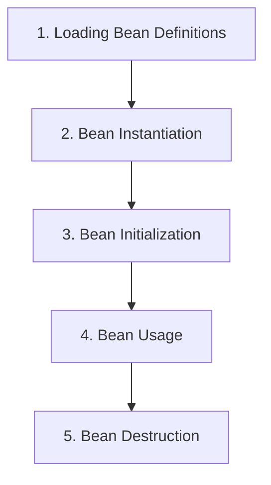

# Spring Introduction  

- **Open-source Java framework**  
- Used to develop **standalone** and **enterprise applications**  
- **2003** – Initial release  
- **2004** – Production release (1.0)  
- Developed by **Rod Johnson**  

---

# Advantages of Spring Framework  

### 1. Modular and Lightweight  
Spring follows a modular architecture, allowing developers to use only the required components.  
This makes applications lightweight, maintainable, and promotes better code organization.  

### 2. Flexible Configuration  
Spring supports multiple configuration styles:  
- **XML-based configuration**  
- **Java-based configuration**  
- **Annotation-based configuration**  

### 3. Dependency Injection (DI)  
Simplifies dependency management, improves testability, and makes applications more adaptable.  

### 4. Aspect-Oriented Programming (AOP)  
Separates cross-cutting concerns (logging, transactions, security), improving modularity.  

### 5. Simplified Database Access  
- **JDBC abstraction** (reduces boilerplate code)  
- **ORM support** (e.g., Hibernate, JPA)  

### 6. Testing Support  
Promotes **unit testing** and provides support for **integration testing**.  

### 7. Security  
**Spring Security** provides robust authentication and authorization.  

### 8. Integration Capabilities  
Integrates with:  
- **Front-end frameworks** (Angular, React)  
- **Messaging systems** (JMS)  
- **Web services** (SOAP, REST)  
- **Third-party APIs and libraries**  

### 9. Scalability  
Supports **cloud-native development** and **microservices architectures**.  

### 10. Open Source  
Free to use, large community, and customizable.  

---

# Spring Container  

### Core Component  
The **Spring Container** is the **core** of the Spring Framework.  

### Responsibilities  
1. **Manage Bean Objects** – Creates and manages bean instances.  
2. **Manage Bean Life-cycle** – Handles bean creation, initialization, and destruction.  
3. **Dependency Injection (DI)** – Ensures loose coupling.  
4. **Transaction Management** – Simplifies transactions and ensures integrity.  
5. **Internationalization (i18n)** – Provides multilingual support.  

### Types of Containers  
- **BeanFactory** – Basic container (fundamental DI support).  
- **ApplicationContext** – Advanced container (extends BeanFactory) with event propagation, AOP, i18n, and enterprise integration.  

---

# Spring Container Diagram  
  

---

# Required Spring JAR Files  

1. **spring-beans-xxx.jar**  
2. **spring-core-xxx.jar**  
3. **spring-context-xxx.jar**  
4. **commons-logging-xxx.jar**  
5. **spring-expression-xxx.jar**  

---

# Complete Spring XML Configuration Example  

### 1. `applicationContext.xml`

```xml
<?xml version="1.0" encoding="UTF-8"?>
<beans xmlns="http://www.springframework.org/schema/beans"
       xmlns:xsi="http://www.w3.org/2001/XMLSchema-instance"
       xsi:schemaLocation="
           http://www.springframework.org/schema/beans
           http://www.springframework.org/schema/beans/spring-beans.xsd">

    <!-- Define a simple bean -->
    <bean id="student" class="com.example.Student">
        <property name="id" value="101"/>
        <property name="name" value="Shreyash"/>
    </bean>

</beans>
```

### 2. `Student.java`
```java
package com.example;

public class Student {
    private int id;
    private String name;

    // Getter and Setter methods
    public int getId() {
        return id;
    }
    public void setId(int id) {
        this.id = id;
    }

    public String getName() {
        return name;
    }
    public void setName(String name) {
        this.name = name;
    }

    // To display bean details
    @Override
    public String toString() {
        return "Student [id=" + id + ", name=" + name + "]";
    }
}
```

### 3.`Main.java`
```java
package com.example;

import org.springframework.context.ApplicationContext;
import org.springframework.context.support.ClassPathXmlApplicationContext;

public class MainApp {
    public static void main(String[] args) {
        // Load Spring XML configuration
        ApplicationContext context = 
            new ClassPathXmlApplicationContext("applicationContext.xml");

        // Get the student bean
        Student student = (Student) context.getBean("student");

        // Print details
        System.out.println(student);
    }
}

```
---
# #Java Based Configuration 

# @Configuration Annotation in Spring 

The **`@Configuration` annotation** is used in **Spring Framework** to indicate that a class contains **bean definitions** and can be used by the Spring IoC container as a **source of configuration**.  

It is part of **Java-based configuration**, which eliminates the need for traditional `XML`-based configuration.  

---

## Key Points  

1. **Purpose**  
   - Declares that a class provides one or more **`@Bean` methods**.  
   - Beans defined in this class will be managed by the **Spring container**.  

2. **Equivalent to XML**  
   - A `@Configuration` class is equivalent to an XML file like `applicationContext.xml`.  

3. **Works with `@Bean`**  
   - Inside a `@Configuration` class, methods annotated with `@Bean` define beans.  
   - Spring automatically registers these beans in the application context.  

4. **Singleton Behavior**  
   - By default, beans declared in `@Configuration` classes are **singleton**.  

# Bean Configuration in Spring

## XML Configuration
In XML configuration, we provide an **`id`** attribute to specify the bean name,  
and we specify the **`class`** name using the `class` attribute.

## Java Configuration
In Java configuration, the **method name** becomes the default bean name,  
and the **return type** of the method determines the class of the object that will be created as the bean.

# Java-based Spring Configuration Example

### 1. `Student.java`
```java
public class Student {
    private int id;
    private String name;

    // Getter and Setter methods
    public int getId() {
        return id;
    }
    public void setId(int id) {
        this.id = id;
    }

    public String getName() {
        return name;
    }
    public void setName(String name) {
        this.name = name;
    }

    // To display bean details
    @Override
    public String toString() {
        return "Student [id=" + id + ", name=" + name + "]";
    }
}
```

### 2.`AppConfig.java`
```java
@Configuration
public class AppConfig {

    // The method name "student" becomes the bean name
    @Bean
    public Student student() {
        Student std=new Student();
        std.setId(101);
        std.setName("shreyash mali")
    }
}
```

### 3.`Main.java`
```java
import org.springframework.context.ApplicationContext;
import org.springframework.context.annotation.AnnotationConfigApplicationContext;

public class MainApp {
    public static void main(String[] args) {
        ApplicationContext context = new AnnotationConfigApplicationContext(AppConfig.class);

        Student s = context.getBean("student", Student.class);
        System.out.println("Student id: " + s.getId());
         System.out.println("Student Name: " + s.getName());
    }
}

```
# @Component Annotation in Spring

The `@Component` annotation in Spring is used to declare a class as a **Spring Bean**, which means it becomes a managed component inside the **Spring Application Context**.

## Key Points:
- It tells Spring to **automatically detect and manage** the class during application startup.
- The managed beans are then made available for:
  - **Dependency Injection (DI)**
  - **Other Spring features** such as AOP, transactions, etc.

---

# Annotation-Based Configuration Example

# @ComponentScan in Spring

## What it does
- `@ComponentScan` tells Spring **where to look** for classes annotated with stereotypes like:  
  - `@Component`  
  - `@Service`  
  - `@Repository`  
  - `@Controller`  
- It **scans the specified package** (and its sub-packages) and **automatically registers those classes as Spring Beans** in the Application Context.

---

### 1. `Student.java`
```java
import org.springframework.stereotype.Component;

@Component   // Marks this as a Spring Bean
public class Student {
    private int id = 101;
    private String name = "Shreyash";

    public void displayInfo() {
        System.out.println("Student ID: " + id);
        System.out.println("Student Name: " + name);
    }
}

```
### 2.`Configuration Class`
```java
import org.springframework.context.annotation.ComponentScan;
import org.springframework.context.annotation.Configuration;

@Configuration
@ComponentScan(basePackages = "com.example") // Change to your package name
public class AppConfig {
}

```
### 3.`Main.java`
```java
import org.springframework.context.ApplicationContext;
import org.springframework.context.annotation.AnnotationConfigApplicationContext;

public class MainApp {
    public static void main(String[] args) {
        ApplicationContext context =
                new AnnotationConfigApplicationContext(AppConfig.class);

        Student student = context.getBean(Student.class);
        student.displayInfo();
    }
}


```
# Spring Bean Lifecycle – Diagram Explanation

---

## Diagram


# Spring Bean Lifecycle Explanation

The lifecycle of a Spring bean goes through several important stages.  
Spring manages these stages automatically.

---

## 1. Loading Bean Definitions
- Spring reads the metadata from **XML**, **Java-based config**, or **Annotations**.
- These definitions tell Spring about the beans it should manage.  

**Example:**  
- XML: `<bean id="student" class="com.example.Student"/>`  
- Java Config: `@Bean`  
- Annotation: `@Component`

---

## 2. Bean Instantiation
- Spring creates the actual object of the bean class.
- Equivalent to using `new Student()` but Spring does this internally.

---

## 3. Bean Initialization
- After instantiation, Spring injects dependencies (like `@Autowired` fields).
- Initialization methods are called:  
  - `@PostConstruct`  
  - or methods specified using `init-method`.

---

## 4. Bean Usage
- The bean is **fully ready** and can be used inside the application.  
- Example: calling `student.study()` inside business logic.

---

## 5. Bean Destruction
- When the `ApplicationContext` is closed or the application shuts down, Spring cleans up.
- Destruction methods are called:  
  - `@PreDestroy`  
  - or methods specified using `destroy-method`.

---
